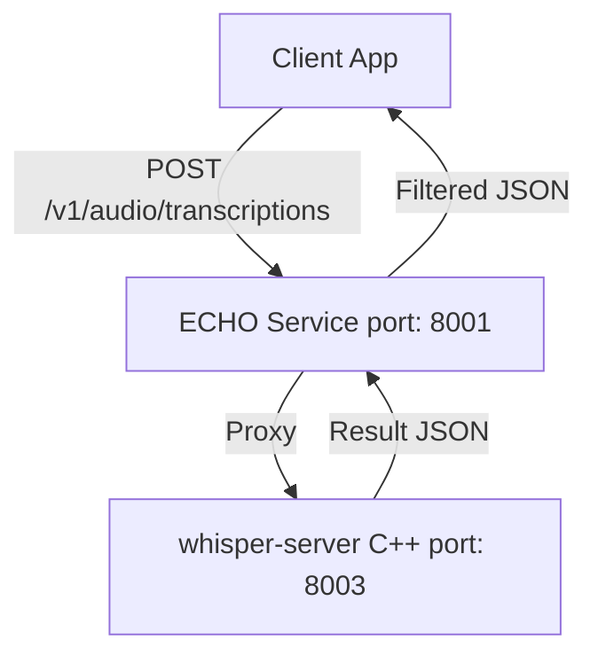
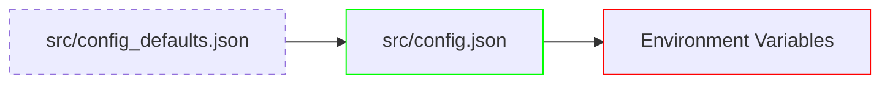

# ECHO Architecture

ECHO is a fast, private, hallucination-resistant speech transcription service designed for home labs. It serves as a drop-in proxy for the OpenAI `/v1/audio/transcriptions` API.

## System Context

ECHO sits between any OpenAI-compatible client and the locally running `whisper.cpp` inference server. 

## Internal Data Flow

When an audio file is uploaded, ECHO passes it through several distinct stages before generating the final text response.

```mermaid
sequenceDiagram
    participant Client
    participant API as ECHO FastAPI (main.py)
    participant VAD as Silero VAD (ONNX)
    participant Whisper as whisper-server (C++)

    Client->>API: POST /v1/audio/transcriptions (WAV)
    
    rect rgb(40, 40, 60)
        Note over API: Pre-processing
        API->>API: 1. Auth Check (Bearer Token)
        API->>API: 2. Head Trim (remove mic clicks)
    end
    
    alt vad_enabled: true
        API->>VAD: Float32 Audio Chunks
        VAD-->>API: Speech Duration (ms)
        alt duration < min_duration
            API-->>Client: {"text": ""} (Early Return)
        end
    end
    
    API->>Whisper: Proxy Audio + Config
    Whisper-->>API: {"text": "raw transcription"}
    
    rect rgb(60, 40, 40)
        Note over API: Post-processing
        API->>API: 3. Hallucination Filter
    end
    
    API-->>Client: {"text": "cleaned transcription"}
```

## Components

| Layer | Component | Description |
|-------|-----------|-------------|
| **Service Framework** | FastAPI | Async Python framework exposing the `/v1/audio/transcriptions` API. |
| **Lifecycle Manager** | `lifespan` | Spawns the `whisper-server` process on startup and gracefully terminates it on shutdown. |
| **VAD Engine** | Silero VAD v6 | Lightweight ONNX model running on the CPU. Scores speech probability in chunks to avoid sending silent clips to the inference engine. |
| **STT Engine** | `whisper-server` | Native C++ binary from `whisper.cpp` bound to `127.0.0.1`. Executed via `subprocess`. |
| **HTTP Client** | `httpx` | Asynchronous proxy client for forwarding the actual processing to the local Whisper instance. |

## Configuration Cascade

ECHO uses a three-layer configuration system to ensure maximum flexibility:

1. **Defaults**: Lowest priority. Shipped with the source code.
2. **Local Overrides**: User-created `config.json` overrides defaults (gitignored).
3. **Env Vars**: Highest priority. Set via `UPPER_CASE` variables in the deployment environment or `launchd` plist.

## VAD Strategy Details

Silero VAD v6 handles inference via the CPU-bound `ONNXRuntime`. Because different ONNX versions of Silero expect different input tensors (some use 4-input LSTM style, newer ones use 2-input state style), the `SileroVAD` wrapper automatically inspects `.get_inputs()` and dynamically sets up the required state tensors.

Audio processing:
1. Converted to 16kHz Float32.
2. Sliced into ~32ms or 96ms chunks.
3. Probability scored against `vad_threshold` (default `0.5`).
4. Total speech ms aggregated. If below `vad_min_speech_duration_ms` (default 200ms), the audio is silently dropped and an empty string is returned, preventing the Whisper model from burning CPU or hallucinating.
